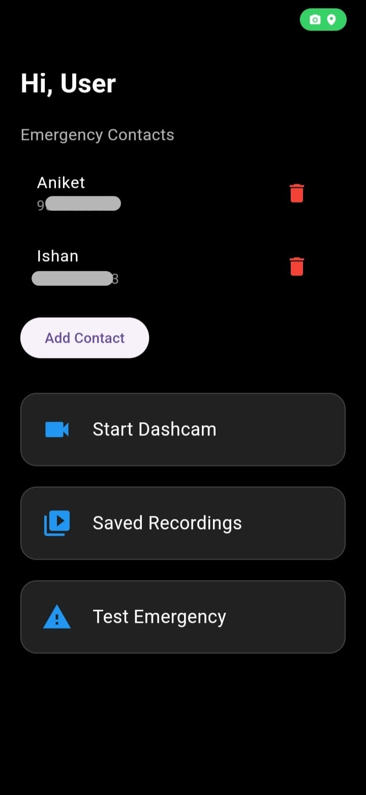
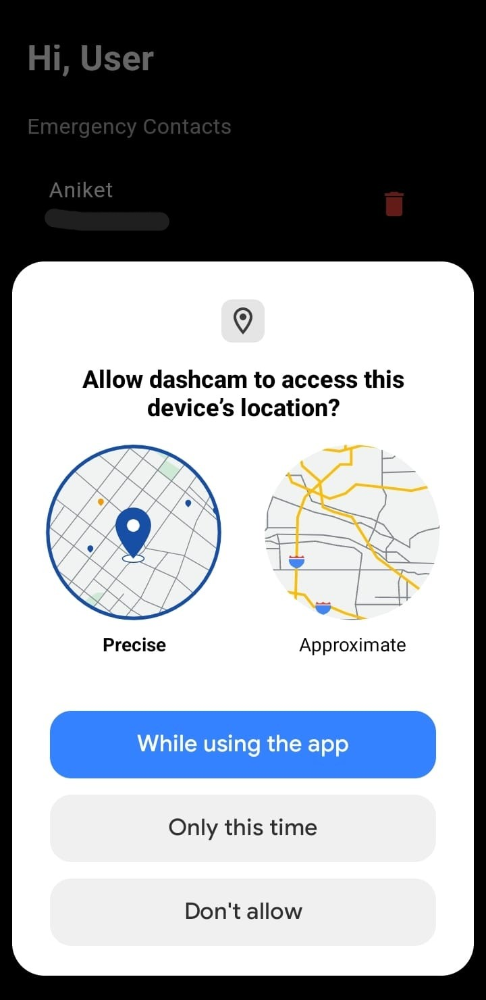
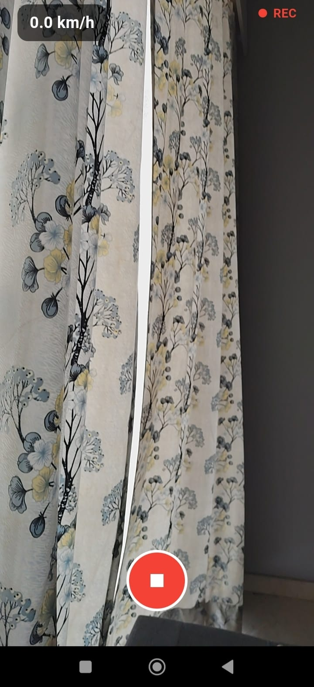
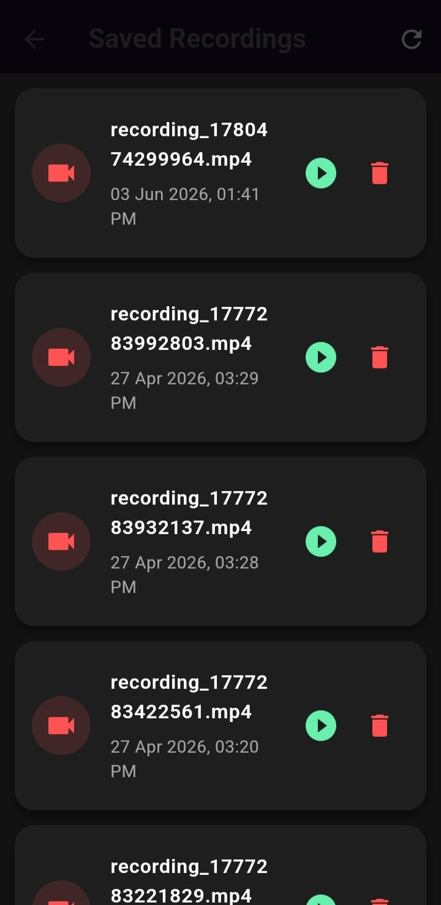
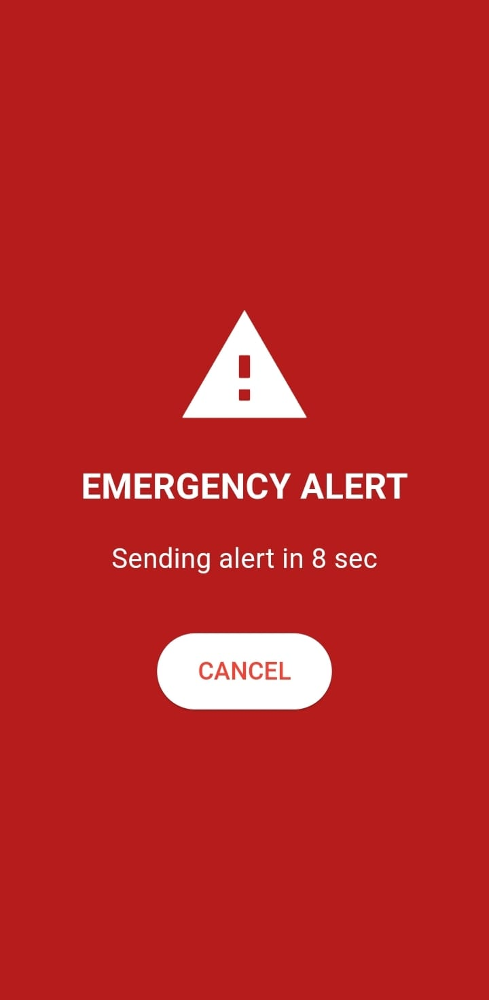

# Environment-Aware DashCam

An intelligent Flutter-based dashcam and emergency alert system that combines real-time sensor monitoring, anomaly detection, automatic video recording, GPS location sharing, and emergency contact notification.

---

## Features

### Real-Time Sensor Monitoring
- Continuous accelerometer monitoring
- Continuous gyroscope monitoring
- GPS-based speed tracking
- Real-time sensor data processing

### Intelligent Anomaly Detection

Detects:
- Crash
- Hard Brake
- Sharp Turn
- Stationary Impact
- Rollover

Each detected event is classified into:
- **ANOMALY**
- **EMERGENCY**

### Automatic DashCam Recording
- Rear camera initialization
- Automatic recording during detected events
- Local video storage
- Manual recording support
- In-app playback

### Emergency Response System
- Automatic emergency detection
- GPS location retrieval
- SMS notification to emergency contacts
- Automatic calling of emergency contacts

---

## Screenshots

<p align="center">
  
  
  
</p>

<p align="center">
  <b>Home Dashboard</b> &nbsp;&nbsp;&nbsp;&nbsp;&nbsp;&nbsp;&nbsp;&nbsp;
  <b>Permissions</b> &nbsp;&nbsp;&nbsp;&nbsp;&nbsp;&nbsp;&nbsp;&nbsp;
  <b>Recording Interface</b>
</p>

<br>

<p align="center">
  
  
</p>

<p align="center">
  <b>Saved Recordings</b> &nbsp;&nbsp;&nbsp;&nbsp;&nbsp;&nbsp;&nbsp;&nbsp;
  <b>Emergency Alert</b>
</p>

---

## System Architecture

```text
Sensors
│
├── Accelerometer
├── Gyroscope
└── GPS Speed
        │
        ▼
SensorManager
        │
        ▼
MainController
        │
        ▼
AnomalyEngine
        │
        ▼
 ┌───────────────┬─────────────────┐
 │               │                 │
 ▼               ▼                 ▼
Recording     Emergency       UI Events
Manager       Service
 │               │
 ▼               ▼
Saved Video   SMS + Calls
```

## Project Structure

```text
lib
│
├── anomaly
│   └── anomaly_engine.dart
│
├── models
│   ├── anomaly_event.dart
│   ├── contact.dart
│   ├── sensor_data.dart
│   └── user.dart
│
├── recording
│   ├── recording_controller.dart
│   ├── recording_manager.dart
│   ├── recording_page.dart
│   └── video_player_page.dart
│
├── sensors
│   └── sensor_manager.dart
│
├── ui
│   ├── add_contact_page.dart
│   └── emergency_alert_page.dart
│
├── utils
│   ├── emergency_service.dart
│   ├── location_service.dart
│   ├── main_controller.dart
│   └── storage_service.dart
│
└── main.dart
```

## Technologies Used

### Framework
- Flutter

### Language
- Dart

### Packages
- camera
- sensors_plus
- geolocator
- shared_preferences
- url_launcher
- video_player
- path_provider
- intl

## Installation

```bash
git clone https://github.com/your-username/Environment-Aware-DashCam.git
cd Environment-Aware-DashCam
flutter pub get
flutter run
```

## Contributors

* [Anannya Yogesh Patil](https://github.com/anannya-patil)
* [Aniket Mandar Patankar](https://github.com/Aniket-317)
* [Ishan Amod Patankar](https://github.com/IshanPats)
* [Parth Rakesh Khadiwala](https://github.com/Parth-1611)
